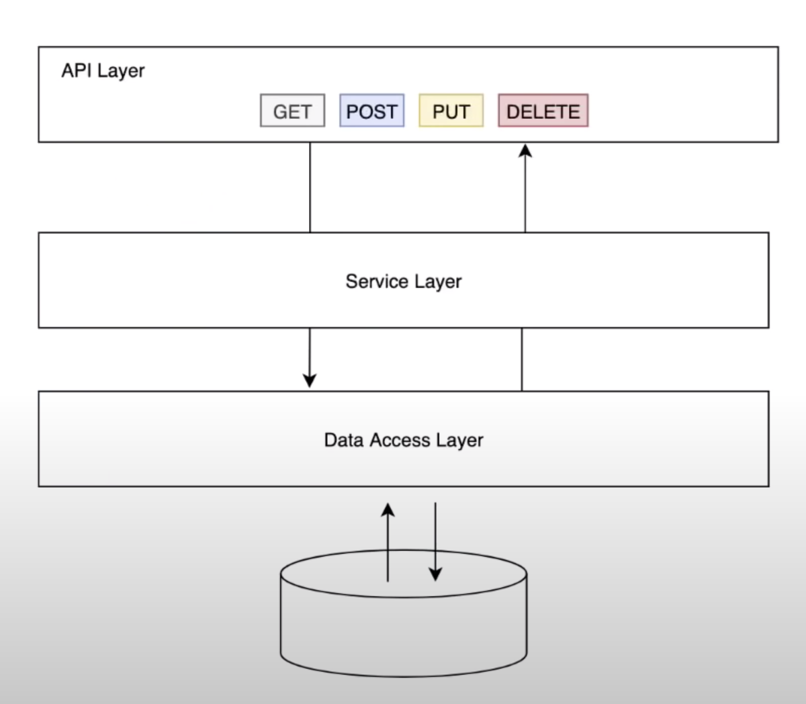

# TimberBase Coding Challenge
This is a simple challenge to test your skills in building APIs. The Timber Base services use mainly Java/Kotlin and Spring Boot technologies.
### What to do

Create a simple API to manage sawmills (CRUD). This API should allow to:

- Create a sawmill
- Edit a sawmill
- Get a specific sawmill
- List sawmills and filter them by name

**A sawmill must have the following fields:**

- name
- city
- country
- created at
- updated at

### Requirements

- All API responses must be JSON
- Provide a README.md file with usage instructions (how to run, endpoints, etc)
- Deploy on Heroku
- Publish your code on GitHub

# The Solution
### FrameWork -  Languages and Dependencies
the code is implemented using Spring Boot version 2.5.8 with Java 8, Postgress, and spring-boot starter test using IntelliJ IDEA.

### How to run the application?
The application can be run in the following ways:

1- Using the <a href="src/main/resources/data/resources/data/demo-0.0.1-SNAPSHOT.jar">jar</a> file in the resources folder. 

2- Cloning the project and running it using IntelliJ IDEA.

### About the Architecture
The architecture used in this repo is as follows:

- The code is designed using the desgin patterns and coding best practice technique ,it's scalable where any new entity can be added easily in the same structure.
- S.O.L.I.D Principles are applied.

#### The End Points

The application is deployed on Heroku, a postman collection can be found in <a href="src/main/resources/data/TimberBase.postman_collection.json">TimberBase.postman_collection.jso</a> to test all the endpoints.

#### Code Test
SpringBootTest is used to run integration tests for the Rest Controller, Positive tests are added.

## suggested improvements
- Make pagination when retrieving all the entities.
- make more tests to catch every exception that might be thrown.
- Add Negative Tests For RestController.# TimberBase Coding Challenge
  This is a simple challenge to test your skills in building APIs. The Timber Base services use mainly Java/Kotlin and Spring Boot technologies.
